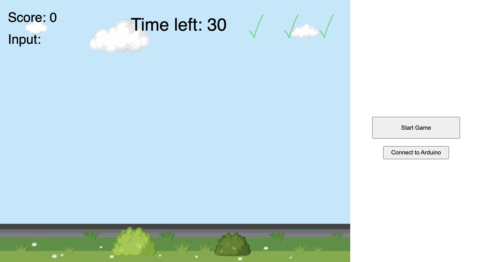

# Digital_Media_Final_Project

## Components
    - Visual Studio for P5.js side
    - Arduino Studio for Arduino Side
    - Breadboard
    - Wires for grounding and power
    - Piezo Buzzer
    - IR Remote
    - IR Receiver module
    - Two LEDs (Green) (Red)

## Project Premise
 The final project consisted of making a game where a player must press 
 the correct buttons to enter a number that displays on the screen. They
 only have a certain amount of time to do this. As they get each number correct,
 the player's score will go up and the numbers will get increasingly bigger 
 while the timer will get shorter but no shorter than 10 seconds. The game has
 custom background music using Tone.js, and a custom sound to go off when the 
 player presses the correct number. Likewise, the Green LED will go off. However,
 when the player gets it wrong or doesn't put in the number in time, the red LED
 will go off, along with the buzzer. Additionally, a check will turn to a X. If
 the player gets three X's, then the game will be over.

## Game Screen

## Video of the game in action
https://youtu.be/5P4NfwomUQc

